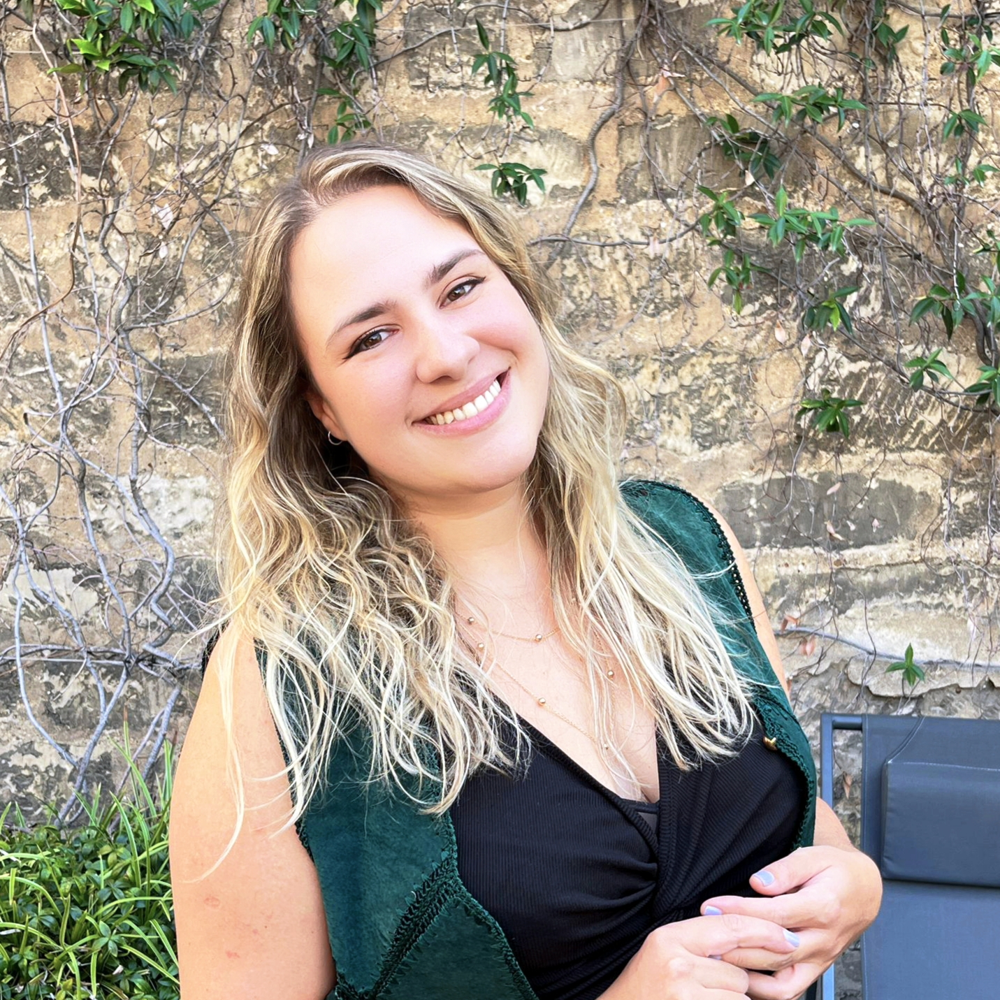

  

    
  

  

    <h3>Luiza Del Giúdice</h3>
    
I’m a Senior Technical Writer with 7 years of experience turning complex computing concepts and procedures into accessible, user-focused documentation. Currently at Deel, writing and testing integration documentation and building AI-assisted content workflows.

    
Currently looking for hybrid opportunities (~3 days remote / 2 days in-office) in the Paris region, or roles in Thailand or South Korea, at tech companies that work in a docs-as-code environment.

  

## Explore my work

  - :octicons-briefcase-16: **[Experience](work-experience/index.md)**
  - :octicons-tools-16: **[Skills and Toolbox](skills.md)**
  - :fontawesome-regular-pen-to-square: **[Writing Samples](writing-samples.md)**
  - :material-certificate-outline: **[Certifications](education/#certifications.md)**

## Contact

  - :fontawesome-brands-linkedin-in: **[LinkedIn](https://linkedin.com/in/luiza-del-giudice)**
  - :material-email-outline: **[Email me](mailto:luizadelgiudicee@gmail.com)**
  - :material-download: **[Download my CV as PDF](assets/luiza-cv.pdf)**

